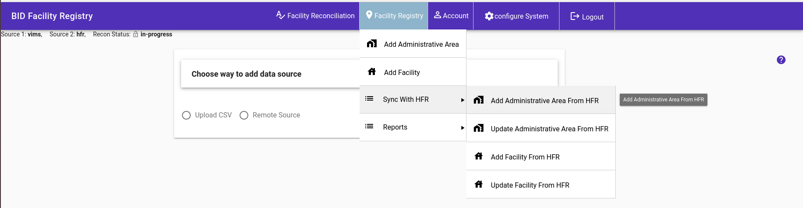
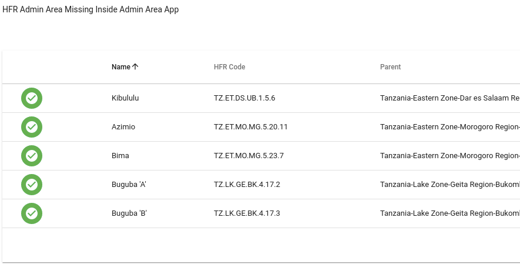
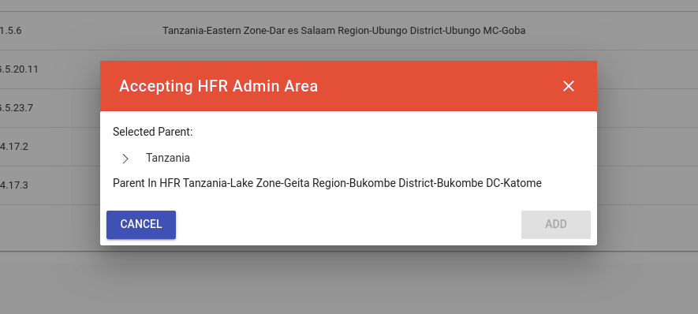

## Add Administrative Area From HFR
This feature let you review new admin areas that have been added to HFR and accept them, once accepted then they become part of the BID Facility Registry 
To add new admin areas from from HFR, go to Facility Registry then Sync with HFR then click Add Administrative Area From HFR

The page lists all new administrative areas and gives you an option to accept and add them.

On Accept, you will need to manually to select the parent of the new admin area.
