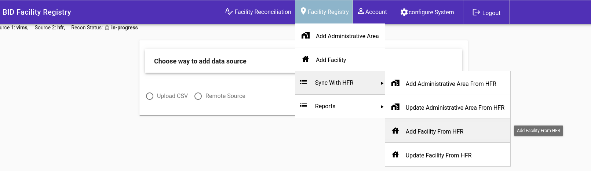
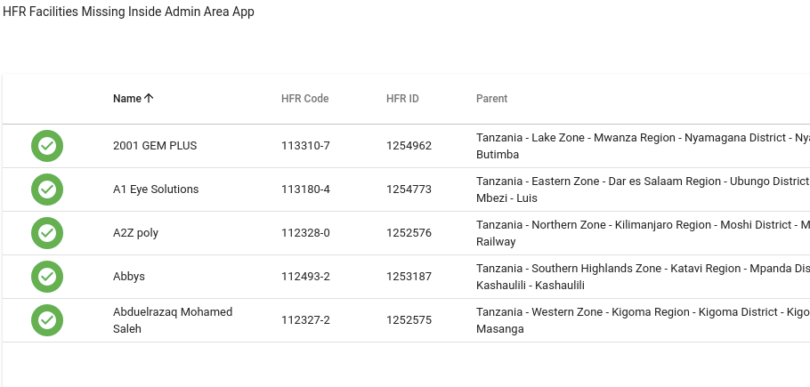
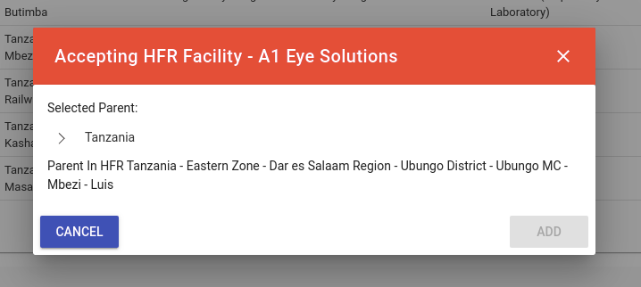

## Add Facilities From HFR
This feature let you review new facilities that have been added to HFR and accept them, once accepted then they become part of the BID Facility Registry 
To add new facilities from HFR, go to Facility Registry then Sync with HFR then click Add Facility From HFR

The page lists all new facilities and gives you an option to accept and add them.

On Accept, you will need to manually reassign the facility to a new parent.
