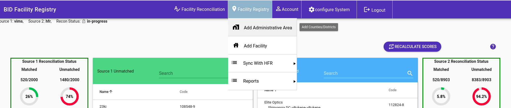
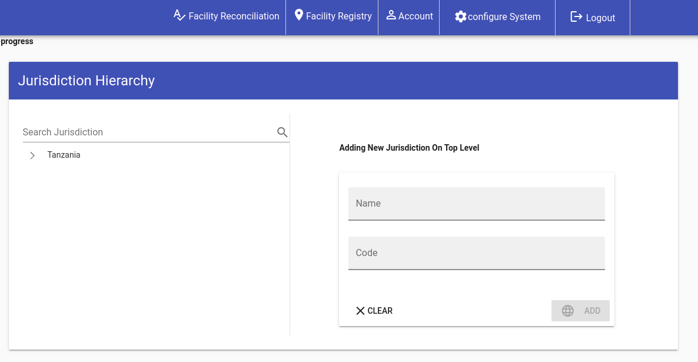

## Adding New Administrative Area
To add a new administrative area go to Facility Registry and click 'Add Administrative Area' menu

You will be taken to a below page to fill in information about the new administrative area 
Use the left Admin Area tree to select the parent of the new administrative area.

NB: If a new administrative area is created at level 5 of the hierarchy then its respective DVS will be automatically created. the administrative area name will be used as the DVS name appended with 'DVS' i.e if the name of the administrative area is Upanga then the DVS will be Upanga DVS