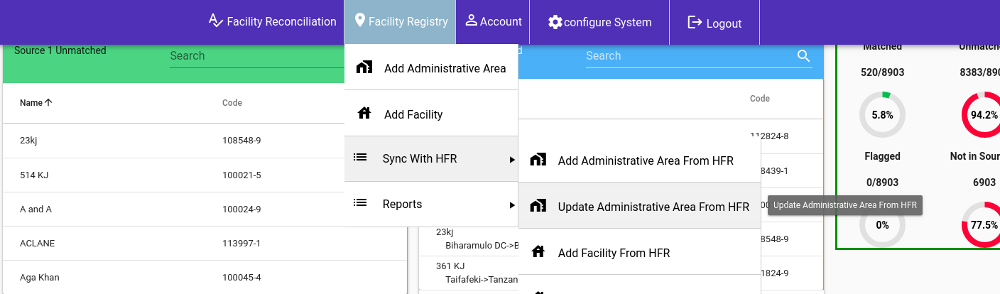
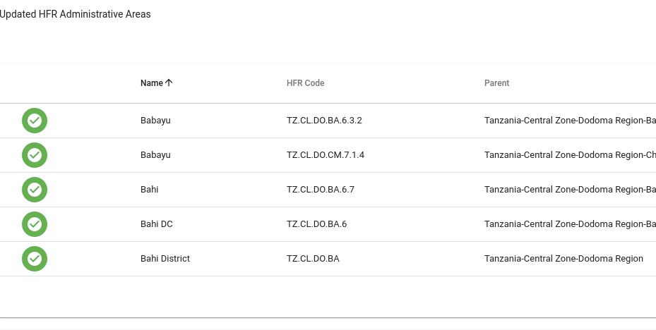
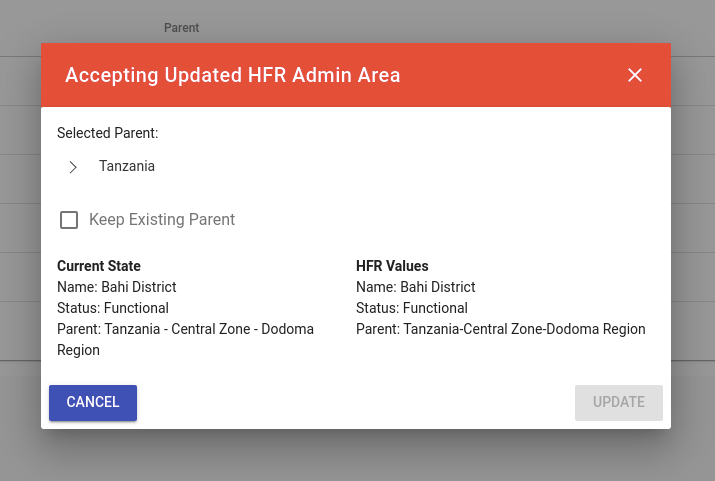

## Update Administrative Area From HFR
This feature let you review changes to admin areas that have been made from HFR and accept them, once accepted then they become part of the BID Facility Registry 
To update administrative areas based on the changes from HFR, go to Facility Registry then Sync with HFR then click Update Administrative Area From HFR

The page lists all updated administrative areas and gives you an option to accept the changes

On Accept, you will need to manually reassign the admin area to a new parent or just keep the existing parent.
